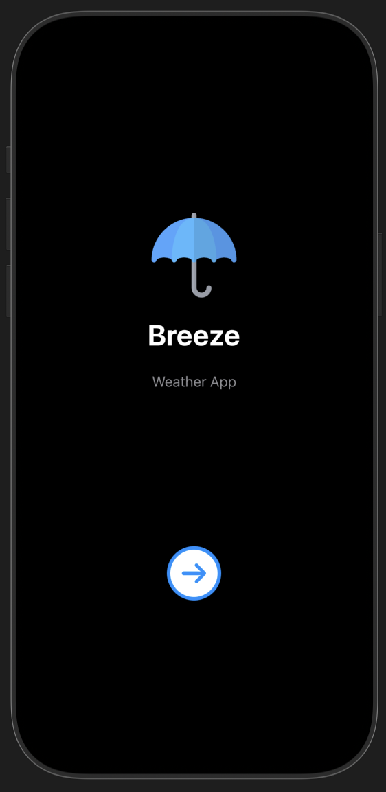
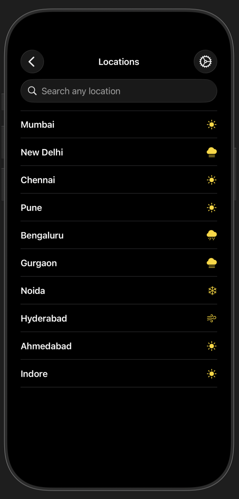
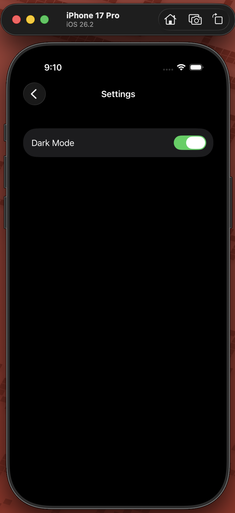
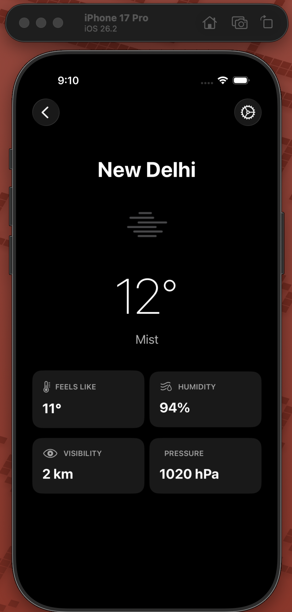

# Weather app

A sleek, lightweight weather application providing real-time updates and reliable offline access.

---

## 1. Navigation & Routing

We utilize a **NavigationStack** paired with a centralized router to manage app flow. By using **Enums**, we ensure type-safety and eliminate "magic strings" when navigating between views.

* **Router File:** Defines a `Route` enum conforming to `Hashable`.
* **Path Management:** A `NavigationPath` is injected as an `ObservableObject` to allow programmatic navigation (e.g., deep linking or popping to root).

## 2. Network Layer

The networking engine is built using **Async/Await** and a protocol-oriented design. This makes the code testable and keeps the UI logic separate from data fetching.

* **Generic Requests:** A single method handles decoding various JSON responses.
* **Endpoint Builder:** Uses URLComponents to safely construct APIs with secure API keys.
* **Error Handling:** Custom `WeatherError` enums catch timeouts, invalid URLs, and decoding failures.

## 3. Persistent Offline Support

To ensure the app remains functional without an internet connection, we integrate **CoreData**.

* **Caching Strategy:** Every successful network fetch updates the local persistent store.
* **Single Source of Truth:** The UI observes the CoreData context. When the network is down, the app seamlessly displays the last cached snapshot.
* **Background Contexts:** Data saving is performed on a background thread to keep the UI buttery smooth.

---

## Screenshots

 
 
 
 
 

